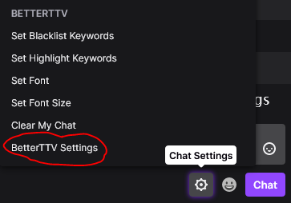
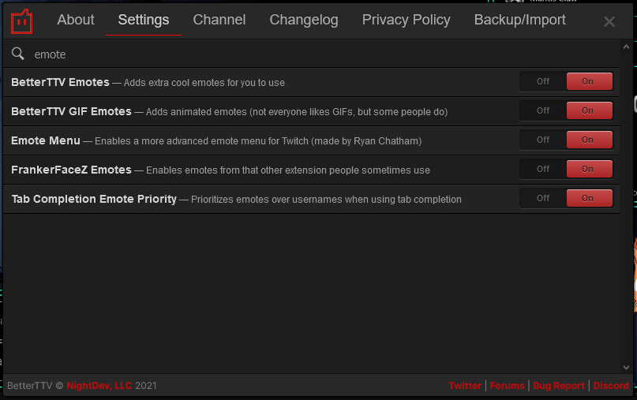
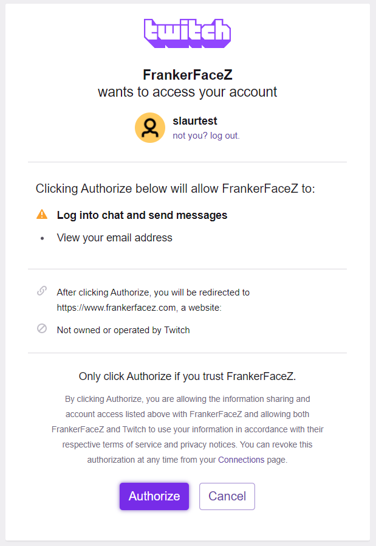
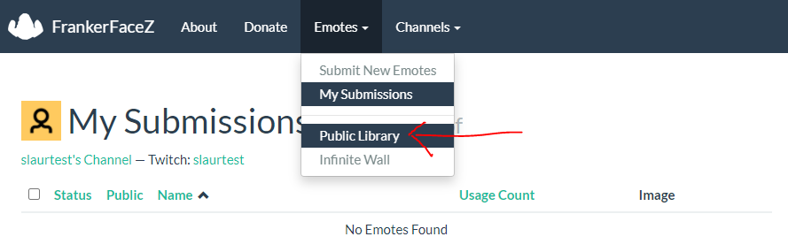
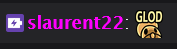
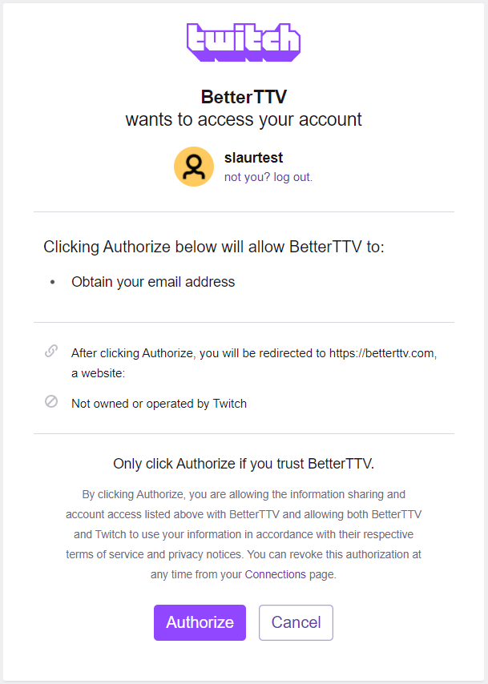

# BetterTTV (BTTV) and FrankerFaceZ (FFZ) Guide

`hollowD` ? `hkGlod` ? What's the meaning of this? This guide will help you setup BTTV and FFZ, and enable the best emotes for your channel.

[BetterTTV][bttv] and [FrankerFaceZ][ffz] are browser extensions which enhance the desktop Twitch experience. They can be installed and configured independently without conflict. They offer some overlapping features.

The most fun benefit they offer is _extra emotes_. These are emotes that non-subbed viewers can use in your chat without needing a subscription.

## For Viewers

### BTTV Settings
After installing BTTV, access the settings via the chat settings menu:

From there, search the settings for `emote`; enable `BetterTTV Emotes`, `BetterTTV GIF Emotes`, `FrankerFaceZ Emotes`.

### FFZ Settings
TODO. You don't need to install FFZ to just see the emotes.

## For Streamers

### FFZ Connection
Go to the [FrankerFaceZ][ffz] and select `Connect with Twitch`. You will be greeted with a message saying "FrankerFaceZ wants to access your account". Click `Authorize` to continue.

You will land on an empty "My Submissions" page. To add emotes, go to the top navigation bar, click `Emotes`, and then click `Public Library`:

Let's add an emote! Under `Filtering` on the right, enter `hkGlod` into the search. Select the result, and click your channel under `Add Selected to Channel`

Now you should be able to type `hkGlod` in chat, and see the emote

### BTTV Connection

Go to [BetterTTV][bttv] and select `Login`. You will be greeted with a message saying "BetterTTV wants to access your account". Click `Authorize` to continue.

From there, go to [shared emotes](https://betterttv.com/emotes/shared) and search for `hollowD`. You should be able to find the [hollowD](https://betterttv.com/emotes/5c308634867e124624c353b6) page, on which you can click `Add to Channel`

[bttv]: https://betterttv.com/
[ffz]: https://www.frankerfacez.com/

