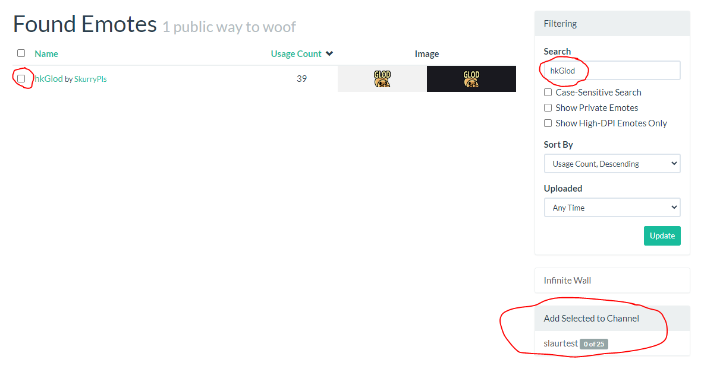
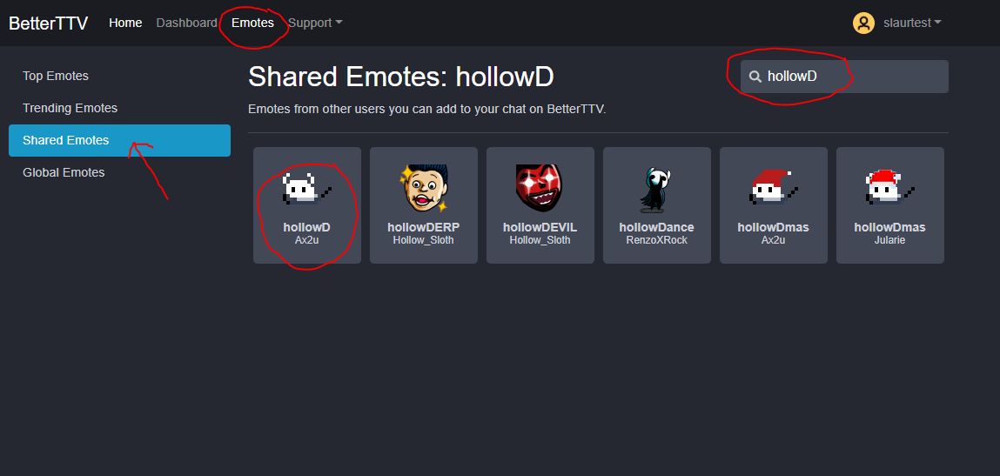
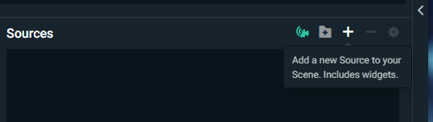
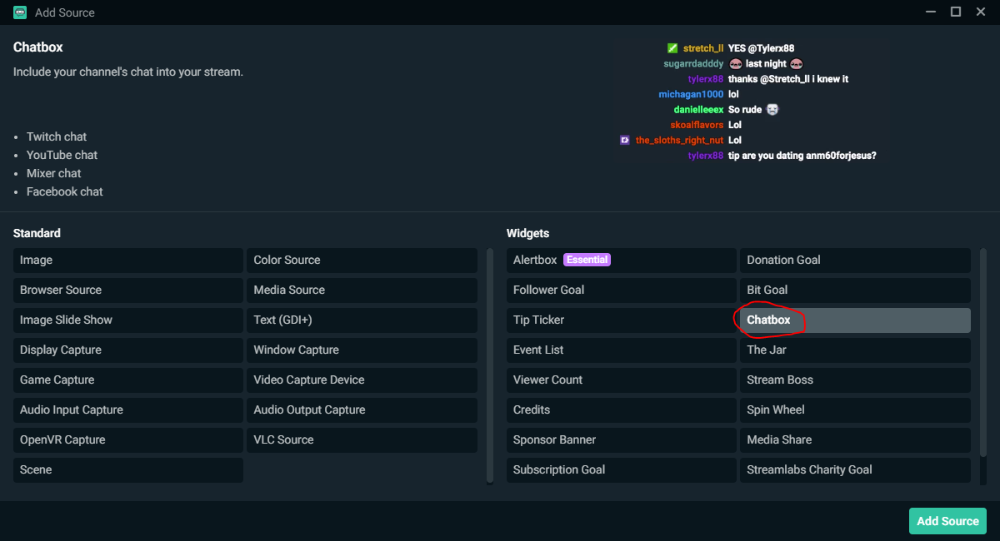
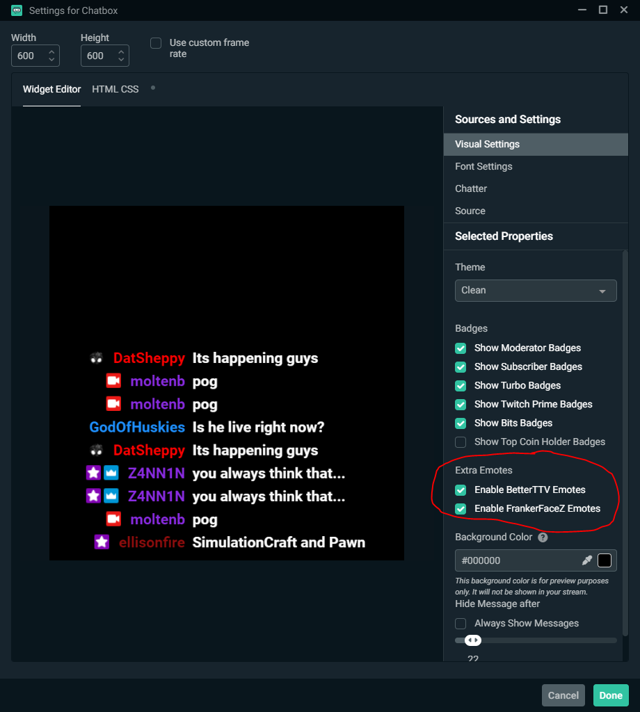

- [BetterTTV (BTTV) and FrankerFaceZ (FFZ) Guide](#betterttv-bttv-and-frankerfacez-ffz-guide)
  - [For Viewers](#for-viewers)
    - [BTTV Settings](#bttv-settings)
    - [FFZ Settings](#ffz-settings)
  - [For Streamers](#for-streamers)
    - [FFZ Connection](#ffz-connection)
    - [BTTV Connection](#bttv-connection)
    - [Streamlabs OBS](#streamlabs-obs)
  - [Trendy Emotes](#trendy-emotes)

 

# BetterTTV (BTTV) and FrankerFaceZ (FFZ) Guide

`hkGlod` ? `hollowD` ? What's the meaning of this? This guide will help you setup BTTV and FFZ, and enable the best emotes for your channel.

[BetterTTV][bttv] and [FrankerFaceZ][ffz] are browser extensions which enhance the desktop Twitch experience. They can be installed and configured independently without conflict. They offer some overlapping features.

The most fun benefit they offer is _extra emotes_. These are emotes that non-subbed viewers can use in your chat without needing a subscription.

## For Viewers

### BTTV Settings
After installing BTTV, access the settings via the chat settings menu:

From there, search the settings for `emote`; enable `BetterTTV Emotes`, `BetterTTV GIF Emotes`, `FrankerFaceZ Emotes`.

### FFZ Settings
You don't need to install FFZ to just see the emotes, but it has other useful features.

## For Streamers

### FFZ Connection
Go to the [FrankerFaceZ][ffz] and select `Connect with Twitch`. You will be greeted with a message saying "FrankerFaceZ wants to access your account". Click `Authorize` to continue.

You will land on an empty "My Submissions" page. To add emotes, go to the top navigation bar, click `Emotes`, and then click `Public Library`:

Let's add an emote! Under `Filtering` on the right, enter `hkGlod` into the search. Select the result, and click your channel under `Add Selected to Channel`

Now you should be able to type `hkGlod` in chat, and see the emote

### BTTV Connection

Go to [BetterTTV][bttv] and select `Login`. You will be greeted with a message saying "BetterTTV wants to access your account". Click `Authorize` to continue.

From there, go to [shared emotes](https://betterttv.com/emotes/shared) and search for `hollowD`. You should be able to find the [hollowD](https://betterttv.com/emotes/5c308634867e124624c353b6) page, on which you can click `Add to Channel`

### Streamlabs OBS
To have the fancy emotes show up on your stream, add a Chatbox source in [Streamlabs OBS][slobs].

Add a new scene source:

Select Chatbox:

Enable BTTV and FFZ emotes:

## Trendy Emotes

| Emote | Link |
|----------------|------|
|  |[hollowD on BTTV](https://betterttv.com/emotes/5c308634867e124624c353b6)|
|  | [peepoArrive on BTTV](https://betterttv.com/emotes/5d922afbc0652668c9e52ead)
|  | [peepoLeave on BTTV](https://betterttv.com/emotes/5e14ca013267f72103fd8462) |
|  | [catJAM on BTTV](https://betterttv.com/emotes/5f1b0186cf6d2144653d2970)
|     | [hkGlod on FFZ](https://www.frankerfacez.com/emoticon/262335-hkGlod) |
|  | [GudTimeLoss on FFZ](https://www.frankerfacez.com/emoticon/314174-GudTimeLoss)
|  | [GudTimeSave on FFZ](https://www.frankerfacez.com/emoticon/132059-GudTimeSave)
|  | [GodTimeSave on FFZ](https://www.frankerfacez.com/emoticon/367644-GodTimeSave)
|  | [shroomPog on FFZ](https://www.frankerfacez.com/emoticon/361872-shroomPog)
|  | [widepeepoHappy on FFZ](https://www.frankerfacez.com/emoticon/270930-widepeepoHappy)

[bttv]: https://betterttv.com/
[ffz]: https://www.frankerfacez.com/
[slobs]: https://streamlabs.com/streamlabs-obs
